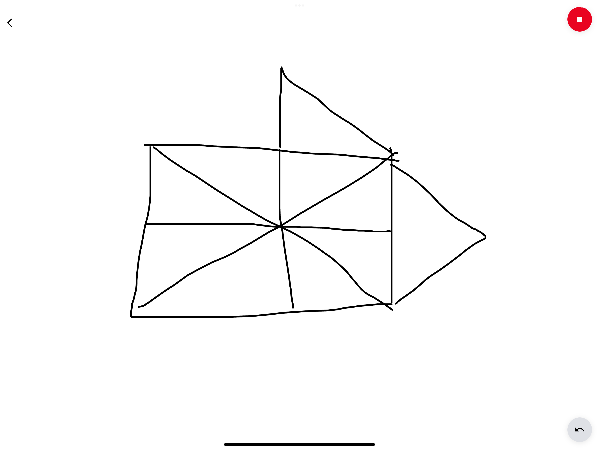
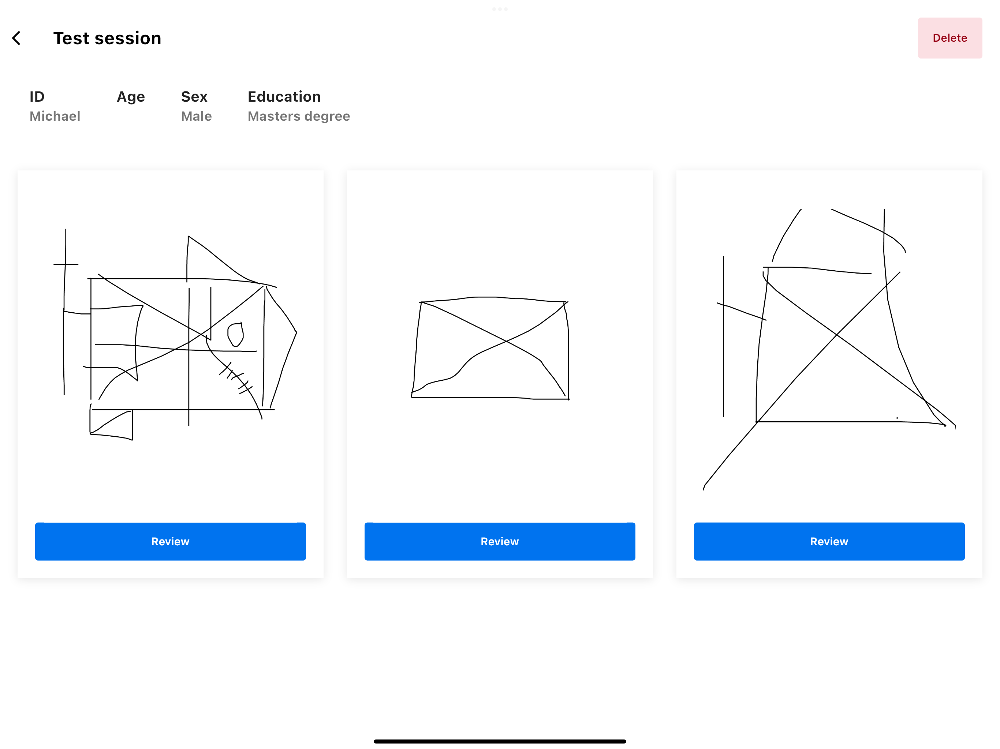
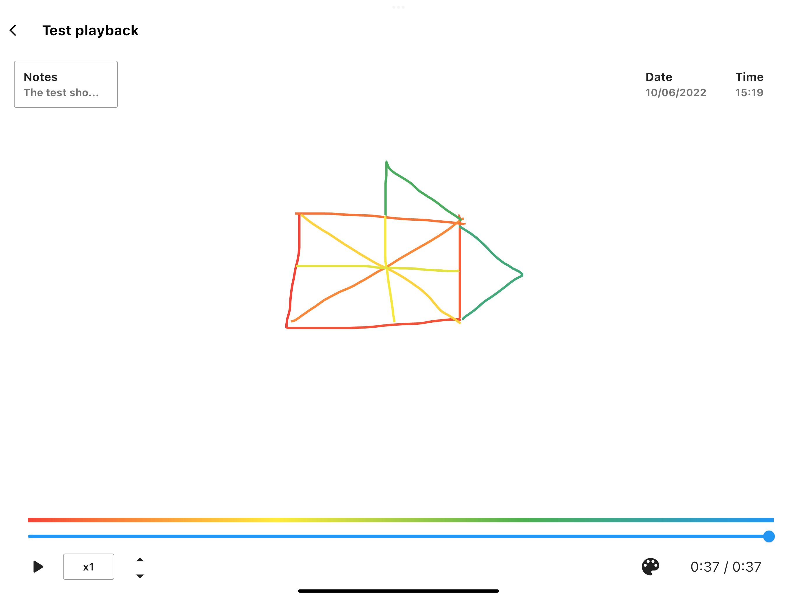
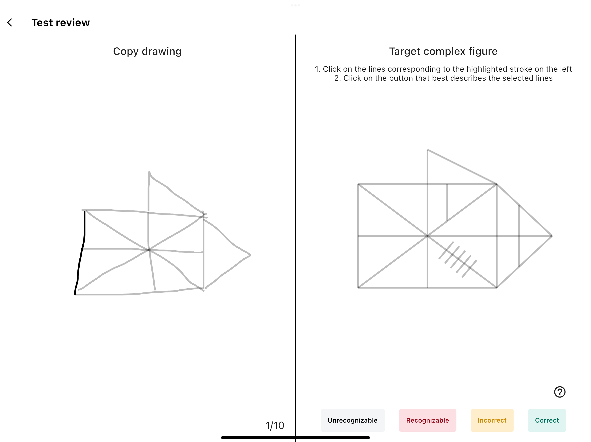

# Complex Figure Test

[](http://badges.mit-license.org)

> A digital version of the pen and paper complex figure drawing test for assessing higher cognitive function.
Built with [Flutter](https://flutter.dev) and [Firebase](https://firebase.com).


*Michael Guldborg 2021*

<p align="center">
	<a href="https://cft.michaelguldborg.dk">
		https://cft.michaelguldborg.dk
	</a>
</p>

<p align="center">
	<a href="#Preview">Preview</a> •
	<a href="#Features">Features</a> •
	<a href="#Development">Development</a> •
	<a href="#refferences">References</a>
</p>

## Preview

<p align="center">
	
	
	
	
</p>


## Features

| Name                | Description | Done |
|---------------------| --- | :---: |
| Authentication      | Sign in, sign up, forgot password  | &#9745; |
| Draw functionality  |  | &#9745; |
| Video playback      |  | &#9745; |
| Clickable assesment |  | &#9745; |
| <b>Total</b>        | --- | 4/4

## Development

```bash
# Install dependencies
$ yarn

# Run on application
$ flutter run

# Deploy to production
$ git push origin master
```


## References
- [GitHub](https://github.com/)
- [Flutter](https://www.flutter.dev/)
- [Firebase Authentication](https://firebase.google.com/docs/auth/)
- [Firebase Firestore](https://firebase.google.com/docs/firestore)
- [Firebase Storage](https://firebase.google.com/docs/storage)
- [Netlify](https://www.netlify.com/)

